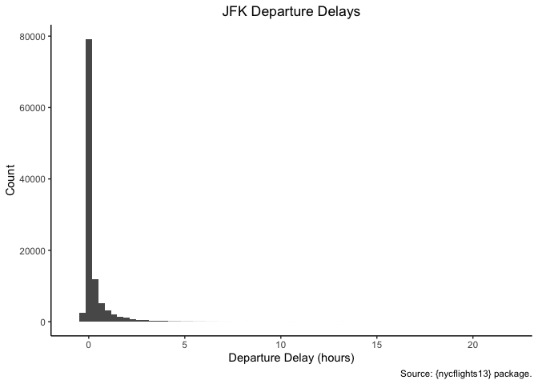

# Assignment \#1
SMPA 2152 (Prof. Bell)

For this homework, please use the `assignment1_template.R` script.
Please submit your completed `.R` script via Blackboard. In addition,
please submit a Word document or PDF containing the visualizations for
questions 5 and 6.

You may complete the assignments on your own or in collaboration with
other students. This means that you may work together to write code
and/or solve problems. **Do not split up the questions or combine
independent work.**

If you work with other students, please indicate their names at the top
of your submission. Each student must submit an assignment on
Blackboard.

------------------------------------------------------------------------

1.  Install the `{nycflights13}` package and load the `flights` data
    frame.

``` r
# Install the "nycflights13" package. I have this line commented out because I only need to install the package once.
# install.packages("nycflights13")
library(nycflights13)
data(flights)
```

2.  Explore the data frame using `glimpse()`. (Remember to load the
    `{dplyr}` package first.) If we wanted to calculate the departure
    delay, can we subtract `dep_time` from `sched_dep_time`? Why or why
    not?

``` r
library(dplyr)
glimpse(flights)
```

    Rows: 336,776
    Columns: 19
    $ year           <int> 2013, 2013, 2013, 2013, 2013, 2013, 2013, 2013, 2013, 2…
    $ month          <int> 1, 1, 1, 1, 1, 1, 1, 1, 1, 1, 1, 1, 1, 1, 1, 1, 1, 1, 1…
    $ day            <int> 1, 1, 1, 1, 1, 1, 1, 1, 1, 1, 1, 1, 1, 1, 1, 1, 1, 1, 1…
    $ dep_time       <int> 517, 533, 542, 544, 554, 554, 555, 557, 557, 558, 558, …
    $ sched_dep_time <int> 515, 529, 540, 545, 600, 558, 600, 600, 600, 600, 600, …
    $ dep_delay      <dbl> 2, 4, 2, -1, -6, -4, -5, -3, -3, -2, -2, -2, -2, -2, -1…
    $ arr_time       <int> 830, 850, 923, 1004, 812, 740, 913, 709, 838, 753, 849,…
    $ sched_arr_time <int> 819, 830, 850, 1022, 837, 728, 854, 723, 846, 745, 851,…
    $ arr_delay      <dbl> 11, 20, 33, -18, -25, 12, 19, -14, -8, 8, -2, -3, 7, -1…
    $ carrier        <chr> "UA", "UA", "AA", "B6", "DL", "UA", "B6", "EV", "B6", "…
    $ flight         <int> 1545, 1714, 1141, 725, 461, 1696, 507, 5708, 79, 301, 4…
    $ tailnum        <chr> "N14228", "N24211", "N619AA", "N804JB", "N668DN", "N394…
    $ origin         <chr> "EWR", "LGA", "JFK", "JFK", "LGA", "EWR", "EWR", "LGA",…
    $ dest           <chr> "IAH", "IAH", "MIA", "BQN", "ATL", "ORD", "FLL", "IAD",…
    $ air_time       <dbl> 227, 227, 160, 183, 116, 150, 158, 53, 140, 138, 149, 1…
    $ distance       <dbl> 1400, 1416, 1089, 1576, 762, 719, 1065, 229, 944, 733, …
    $ hour           <dbl> 5, 5, 5, 5, 6, 5, 6, 6, 6, 6, 6, 6, 6, 6, 6, 5, 6, 6, 6…
    $ minute         <dbl> 15, 29, 40, 45, 0, 58, 0, 0, 0, 0, 0, 0, 0, 0, 0, 59, 0…
    $ time_hour      <dttm> 2013-01-01 05:00:00, 2013-01-01 05:00:00, 2013-01-01 0…

``` r
flights$new_dep_delay <- flights$dep_time - flights$sched_dep_time
identical(flights$new_dep_delay, flights$dep_delay)
```

    [1] FALSE

`dep_time` and `sched_dep_time` are integers, not times (e.g., `600-557`
is `43`, not `3` minutes).

3.  Now we want to find out how many flights were delayed by 30 minutes
    or more when departing JFK airport. First, create a new data frame
    with only those rows where the origin airport is “JFK” and where the
    departure delay is greater than or equal to 30. Then, use the
    `nrow()` function to get the number of rows in the resulting data
    frame.

``` r
jfk_delays <- flights[flights$origin == "JFK" & flights$dep_delay >= 30,]
nrow(jfk_delays)
```

    [1] 17475

4.  In your new data frame, create a new column that represents the
    departure delay in hours rather than minutes (i.e., divide departure
    delay by 60). What is the average departure delay of these flights
    in hours? Hint: look at the help file for `mean()`. How can you ask
    this function to ignore the flights where the departure delay is
    `NA` (because the flight was cancelled)?

``` r
jfk_delays$dep_delay_hours <- jfk_delays$dep_delay/60
mean(jfk_delays$dep_delay_hours, na.rm = TRUE)
```

    [1] 1.413193

5.  Create a histogram showing the departure delays from JFK airport in
    hours. Each bar should represent 20 minutes (i.e., 1/3 of an hour).
    Your graph should include a theme, a title, proper axis labels, and
    a caption.

``` r
library(ggplot2)
ggplot(data = jfk_delays) +
  geom_histogram(mapping = aes(x = dep_delay_hours), binwidth = .33) +
  theme_classic() +
  labs(x = "Departure Delay (hours)",
       y = "Count",
       title = "JFK Departure Delays",
       caption = "Source: {nycflights13} package.") +
  theme(plot.title = element_text(hjust = .5))
```



6.  Let’s return to the original `flights` data frame now. Limit the
    data frame to only the three major airlines (`AA` for American
    Airlines, `DL` for Delta Airlines, and `UA` for United Airlines).
    Create a bar graph showing how many flights each airline took from
    each of the three NYC airports (JFK, LGA, and EWR). Your graph
    should include a theme, a title, proper axis labels, and a caption.

``` r
ggplot(data = flights[flights$carrier %in% c("AA", "DL", "UA"),]) +
  geom_bar(mapping = aes(x = origin, fill = carrier), position = "dodge") +
  theme_classic() +
  labs(x = "Airport",
       y = "Count",
       fill = "Airline",
       title = "Which Major Airlines Fly from NYC Airports?",
       caption = "Source: {nycflights13} package.") +
  theme(plot.title = element_text(hjust = .5))
```


