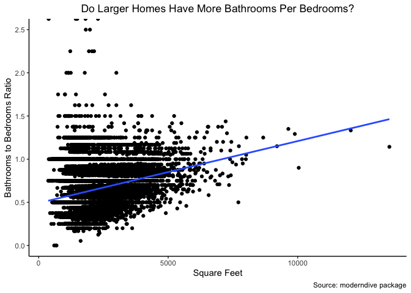
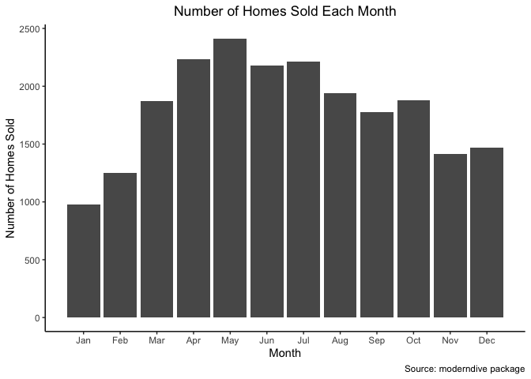

# Assignment \#2
SMPA 2152 (Prof. Bell)

For this homework, please use the `assignment2_template.R` script.
Please submit your completed `.R` script via Blackboard. In addition,
please submit a Word document or PDF containing the visualizations and
your responses to the questions.

**To save a graph and download it to your computer in Posit Cloud:**

1.  In the “Plots” pane, select “Export” and then “Save as Image.”

2.  Give the file a name and use the drag button in the corner of the
    graph to resize the image to proper dimensions. Click “Save.”

3.  In the “Files” pane, select the check mark next to your `.png` file.
    Click “More”, and then “Export…” Click “Download” to download the
    file to your computer.

    If you select the check mark next to multiple files, you will export
    a .zip folder. Before submitting any work in this class, you must
    unzip the folder to obtain the unzipped files. Do not submit a zip
    folder for an assignment.

You may complete the assignments on your own or in collaboration with
other students. This means that you may work together to write code
and/or solve problems. **Do not split up the questions or combine
independent work.**

If you work with other students, please indicate their names at the top
of your submission. Each student must submit an assignment on
Blackboard.

------------------------------------------------------------------------

Before you begin, you will need to install and load the `{moderndive}`
package (as well as any other packages you will need) and load the
`house_prices` data.

``` r
library(ggplot2)
library(moderndive)
data(house_prices)
```

For this homework, please generate an appropriate visualization to
answer the question. Your visualizations should be nicely-formatted,
with a theme, axis labels, a title, and a caption with the source of the
data. In your Word document or PDF containing the visualizations, please
also include your written response to the question. Only a brief
explanation (1-2 sentences) is required.

1.  Do homes with better views command a higher sales price? Please
    report prices in \$1000s, so divide price by 1000. (For `view`, 0 =
    Poor, 1 = Fair, 2 = Average, 3 = Good, and 4 = Very Good.)

    *Hint: To convert a numeric variable to a categorical variable, use
    the `factor(x)` function in your `aes()` mapping, where `x` is the
    name of the variable you would like to convert.*

``` r
ggplot(data = house_prices) +
    geom_boxplot(aes(x = factor(view), y = price/1000)) +
    labs(x = "Quality of View",
             y = "Price ($1000s)",
             title = "Price of Homes Sold by Quality of View",
             caption = "Source: moderndive package") +
    theme_classic() +
    theme(plot.title = element_text(hjust = .5))
```


> Homes with better views command higher prices on average, but there
> are also many homes without good views that sell for higher prices
> than the homes with the best views. View quality is not the only
> factor that determines a home price.

2.  When homes get larger, are constructors more likely to add
    additional bedrooms or additional bathrooms? To answer this
    question, calculate a new variable that is the ratio of bathrooms to
    bedrooms (i.e., `bathrooms/bedrooms`). Do larger homes (as measured
    by `sqft_living`) have more bathrooms per bedrooms?

    *Hint: You will need to use two geom\_\*() layers to answer this
    question.*

``` r
house_prices$bath_per_bed <- house_prices$bathrooms/house_prices$bedrooms

ggplot(house_prices) +
    geom_point(aes(x = sqft_living, y = bath_per_bed)) +
    geom_smooth(aes(x = sqft_living, y = bath_per_bed), method = "lm", se = FALSE) +
    labs(x = "Square Feet",
             y = "Bathrooms to Bedrooms Ratio",
             title = "Do Larger Homes Have More Bathrooms Per Bedrooms?",
             caption = "Source: moderndive package") +
  theme_classic() +
    theme(plot.title = element_text(hjust = .5))
```



> Larger homes tend to have more bathrooms per bedrooms. This suggests
> that constructors may be more likely to use additional square footage
> for bathrooms than bedrooms.

3.  Complete the following code to generate a graph showing how the
    number of monthly home sales changes over the course of the year (we
    will learn what this code does in a couple of weeks). **You must use
    the code as it is provided here - notice the class of vector for
    `month`.** Modify the axes to better fit the data. What is the most
    popular time of year for home sales? Why do you think this might be?

    *Hint: This is a univariate graph.*

``` r
library(dplyr)
house_prices |>
  mutate(month = format(date, "%m")) |>
  ggplot() +
    ...
```

``` r
library(dplyr)
house_prices |>
  mutate(month = as.numeric(format(date, "%m"))) |>
  ggplot() +
    geom_bar(aes(x = month)) +
    scale_x_continuous(breaks = 1:12, labels = month.abb) +
    labs(x = "Month",
         y = "Number of Homes Sold",
         title = "Number of Homes Sold Each Month",
         caption = "Source: moderndive package") +
    theme_classic() +
    theme(plot.title = element_text(hjust = .5))
```



> The most popular month for home sales is May, probably because summer
> moves are least disruptive to the school year for children.
