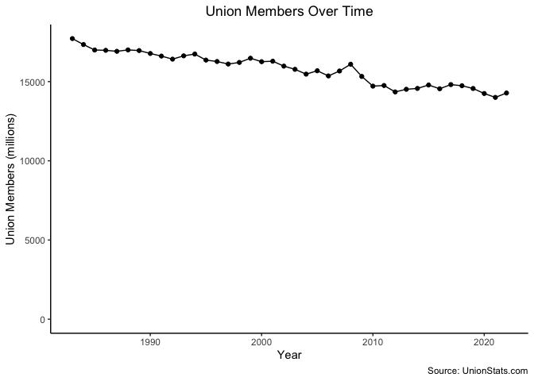
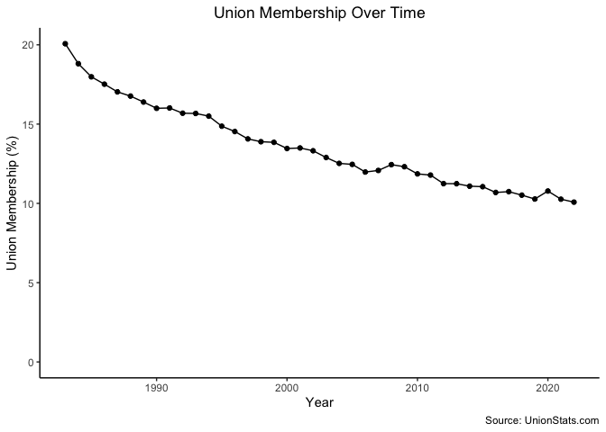

# Assignment \#3
SMPA 2152 (Prof. Bell)

This week’s homework uses data on union membership in the United States
from [](https://www.unionstats.com/) by Barry Hirsch (Georgia State
University), David Macpherson (Trinity University), and William Even
(Miami University). The data is provided to you as
`union_membership.csv`.

You will find the following columns in the data:

| variable           | class     | description                                         |
|:-------------------|:----------|:----------------------------------------------------|
| state_census_code  | double    | Census state code used in CPS                       |
| state              | character | State name                                          |
| employment         | double    | Wage and salary employment in thousands             |
| members            | double    | Employed workers who are union members in thousands |
| state_abbreviation | character | State abbreviation                                  |
| year               | double    | Year of the survey                                  |

For this homework, please submit a `.qmd` file as well as a rendered
`.html` (with the proper header using `embed-resources: true`) or `.pdf`
file. If you are unable to successfully render your `.qmd` script, you
should still submit it for partial credit.

You may complete the assignments on your own or in collaboration with
other students. This means that you may work together to write code
and/or solve problems. **Do not split up the questions or combine
independent work.**

If you work with other students, please indicate their names at the top
of your submission. Each student must submit an assignment on
Blackboard.

------------------------------------------------------------------------

``` r
library(tidyverse)
library(knitr)
```

1.  Load the `union_membership.csv` data.

``` r
union <- readr::read_csv("union_membership.csv")
```

2.  Generate a nicely-formatted table showing the five states with the
    largest percentage of union members in 2022.

``` r
union |>
  filter(year == 2022) |>
  mutate(union_perc = (members/employment)*100) |>
  arrange(desc(union_perc)) |>
  select(state, union_perc) |>
  slice_head(n = 5) |>
  kable()
```

| state        | union_perc |
|:-------------|-----------:|
| Hawaii       |   21.74842 |
| New York     |   20.64560 |
| Washington   |   17.98393 |
| Rhode Island |   16.20151 |
| California   |   16.11152 |

3.  Create a nicely-formatted graph that shows the total number of union
    members in millions of workers over time.

    *Hint: The `members` column is already in thousands.*

``` r
union |>
  group_by(year) |>
  summarize(union_members = sum(members)) |>
  mutate(union_members = union_members/1000) |>
  ggplot(aes(x = year, y = union_members)) +
  geom_line() +
  geom_point() +
  scale_y_continuous(limits = c(0,NA)) +
  labs(x = "Year",
       y = "Union Members (millions)",
       title = "Union Members Over Time",
       caption = "Source: UnionStats.com") +
  theme_classic() +
  theme(plot.title = element_text(hjust = .5))
```



4.  Make the same graph, but this time, use the *percentage* of workers
    who are in a union rather than the total number of union members.

``` r
union |>
  group_by(year) |>
  summarize(union_perc = (sum(members)/sum(employment))*100) |>
  ggplot(aes(x = year, y = union_perc)) +
  geom_line() +
  geom_point() +
  scale_y_continuous(limits = c(0,NA)) +
  labs(x = "Year",
       y = "Union Membership (%)",
       title = "Union Membership Over Time",
       caption = "Source: UnionStats.com") +
  theme_classic() +
  theme(plot.title = element_text(hjust = .5))
```



5.  Produce a nicely-formatted table showing the five states with the
    largest percentage point change in the percent of workers who are
    unionized between 1983 and 2022. (A percentage point change means
    that you are subtracting one percentage from another.)

    *Hint: You will need to use `arrange()`, `first()`, and `last()` to
    do this math. Check the `dplyr` cheat sheet for a clue about where
    to use these functions.*

``` r
union |>
  mutate(union_perc = (members/employment)*100) |>
  arrange(state, year) |>
  group_by(state) |>
  summarize(union_perc_change = last(union_perc) - first(union_perc)) |>
  arrange(union_perc_change) |>
  slice_head(n = 5) |>
  kable()
```

| state         | union_perc_change |
|:--------------|------------------:|
| Indiana       |         -17.54603 |
| Wisconsin     |         -16.73925 |
| Michigan      |         -16.43284 |
| West Virginia |         -16.05650 |
| Pennsylvania  |         -14.81042 |
