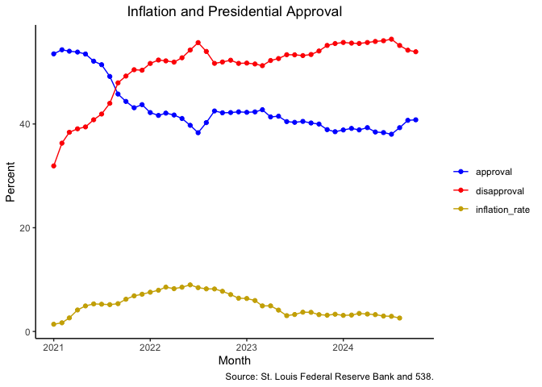

# Assignment \#4
SMPA 2152 (Prof. Bell)

This week’s homework uses two data sources:

- data on monthly inflation from the [Federal Reserve Bank of
  St. Louis](https://fred.stlouisfed.org/). The data measures the
  percentage change in prices from the previous year.
- data on President Biden’s approval rating from
  [538](https://projects.fivethirtyeight.com/biden-approval-rating/).

We will be exploring whether the inflation rate affects presidential
approval.

For this homework, please submit a `.qmd` file as well as a rendered
`.html` (with the proper header using `embed-resources: true`) or `.pdf`
file. If you are unable to successfully render your `.qmd` script, you
should still submit it for partial credit.

You may complete the assignments on your own or in collaboration with
other students. This means that you may work together to write code
and/or solve problems. **Do not split up the questions or combine
independent work.**

If you work with other students, please indicate their names at the top
of your submission. Each student must submit an assignment on
Blackboard.

------------------------------------------------------------------------

``` r
library(tidyverse)
```

1.  Load the `inflation.csv` data and turn it into tidy data.

``` r
inflation <- readr::read_csv("inflation.csv")

inflation_tidy <- pivot_longer(inflation,
                               `1`:`12`,
                               names_to = "month",
                               values_to = "inflation_rate")
```

2.  Using President Biden’s average rating in each month, join the
    `presidential_approval.csv` data to the inflation data. Keep both
    the approval rating **and** the disapproval rating.

    *(Hint: you may need to convert the month numbers in the inflation
    data into a numeric vector rather than a character vector.)*

``` r
approval <- read_csv("presidential_approval.csv")
approval_monthly <-
  approval |>
  group_by(year, month) |>
  summarize(approval = mean(approve_estimate),
            disapproval = mean(disapprove_estimate))
inflation_tidy <- mutate(inflation_tidy, month = as.numeric(month))
merged <- left_join(approval_monthly, inflation_tidy, by = join_by(year == YEAR, month))
```

3.  Make a graph showing the inflation rate, approval rate, and
    disapproval rate over the course of President Biden’s administration
    on the same plot. Use blue to indicate approval, red to indicate
    disapproval, and any other color to indicate the inflation rate. Is
    presidential approval related to the inflation rate? Why or why not?

    *(Hint: you can use the ym() function to convert a single vector
    with year and month (e.g., “2021-1”) to a date for your x-axis.)*

``` r
merged |>
  mutate(date = ym(paste(year, month, sep = "-"))) |>
  pivot_longer(c(approval, disapproval, inflation_rate),
               names_to = "category",
               values_to = "percent") |>
  ggplot(aes(x = date, y = percent, color = category)) +
  geom_line() +
  geom_point() +
  scale_color_manual(values = c("blue", "red", "gold3")) +
  labs(x = "Month",
       y = "Percent",
       title = "Inflation and Presidential Approval",
       color = "",
       caption = "Source: St. Louis Federal Reserve Bank and 538.") +
  theme_classic() +
  theme(plot.title = element_text(hjust = .5))
```


