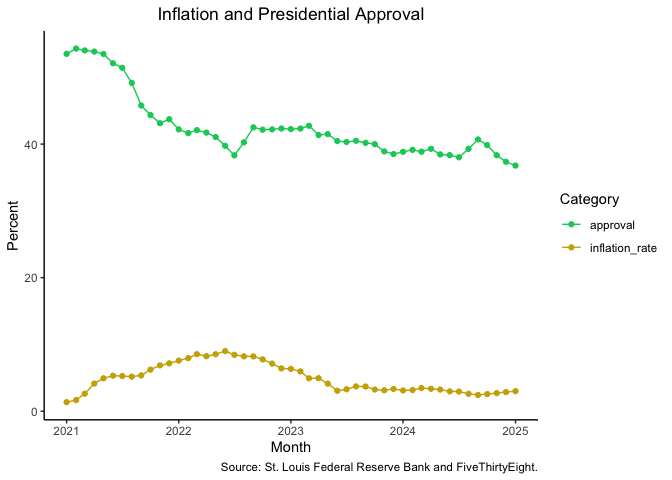

# Problem Set \#4
SMPA 2152 (Prof. Bell)

This week’s homework uses two data sources:

- data on monthly inflation from the [Federal Reserve Bank of
  St. Louis](https://fred.stlouisfed.org/series/CPIAUCSL). The data
  measures the percentage change in prices from the previous year.
- data on President Biden’s approval rating from
  [FiveThirtyEight](https://projects.fivethirtyeight.com/biden-approval-rating/).

We will be exploring whether the inflation rate affected President
Biden’s approval rating.

For this homework, please submit a `.qmd` file as well as a rendered
`.html` (with the proper header using `embed-resources: true`) or `.pdf`
file. If you are unable to successfully render your `.qmd` script, you
should still submit it for partial credit.

You may complete the assignments on your own or in collaboration with
other students. This means that you may work together to write code
and/or solve problems. **Do not split up the questions or combine
independent work.**

If you work with other students, please indicate their names at the top
of your submission. Each student must submit an assignment on
Blackboard.

------------------------------------------------------------------------

``` r
library(tidyverse)
```

1.  Load the `inflation.csv` data and turn it into tidy data.

``` r
inflation <- read_csv("inflation.csv")

inflation_tidy <- pivot_longer(inflation,
                               `1`:`12`,
                               names_to = "month",
                               values_to = "inflation_rate")
```

2.  Calculate President Biden’s average approval rating
    (`approve_estimate`) in each month and join the
    `presidential_approval.csv` data to the inflation data.

    *Hint: You may need to convert the month numbers in the inflation
    data into a numeric vector rather than a character vector.*

``` r
approval <- read_csv("presidential_approval.csv")
approval_monthly <-
  approval |>
  group_by(year, month) |>
  summarize(approval = mean(approve_estimate))
inflation_tidy <- mutate(inflation_tidy, month = as.numeric(month))
merged <- left_join(approval_monthly, inflation_tidy, by = join_by(year == YEAR, month ))
```

3.  Make a graph comparing the inflation rate and President Biden’s
    approval rating. Use the color `"springgreen3"` to indicate
    presidential approval and any other color to indicate the inflation
    rate. Is presidential approval related to the inflation rate? Why or
    why not?

    *Hint: You can use the make_date() function to create a date column
    for your x-axis:*

``` r
merged |>
  mutate(date = make_date(year, month))
```

``` r
merged |>
  mutate(date = make_date(year, month)) |>
  pivot_longer(c(approval, inflation_rate),
               names_to = "category",
               values_to = "percent") |>
  ggplot(aes(x = date, y = percent, color = category)) +
  geom_line() +
  geom_point() +
  scale_color_manual(values = c("springgreen3", "gold3")) +
  labs(x = "Month",
       y = "Percent",
       title = "Inflation and Presidential Approval",
       color = "Category",
       caption = "Source: St. Louis Federal Reserve Bank and FiveThirtyEight.") +
  theme_classic() +
  theme(plot.title = element_text(hjust = .5))
```



> It appears that presidents are punished for rising inflation rates,
> but are not rewarded for declining inflation rates. As the inflation
> rate rises in the first half of President Biden’s term, his approval
> rating declines. However, as the inflation rate decreases and then
> stabilizes in the second half of his term, his approval rating does
> not improve (and actually continues to decline somewhat).
