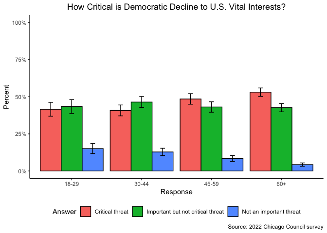

# Assignment \#6
SMPA 2152 (Prof. Bell)

For this week’s homework, we will work with survey data from the Chicago
Council on Global Affairs, which is widely considered to be the
gold-standard measure of Americans’ attitudes towards foreign policy.
You will need to download the 2022 survey data from Roper iPoll using
this link: <https://doi.org/10.25940/ROPER-31120078>

------------------------------------------------------------------------

``` r
library(tidyverse)
dta <- read_csv("31120078.csv")
```

1.  Some of the variables used to generate the survey weights are:

> - Gender (`ppgender`)
> - Age (`ppagect4`)
> - Race (`ppethm`)
> - Census Region (`ppreg4`)
> - Urban/Rural (`xurbanicity`)
> - Education (`ppeducat`)
> - Income (`ppinc7`)

On your own, conduct an exploratory data analysis to determine which
groups the survey had difficulty reaching. Do not include this
exploratory analysis in your Quarto report.

In your Quarto report, present **one** graph that shows the distribution
of weights for one of the variables – the one that includes a group(s)
that was difficult for the survey to reach. Provide a possible
explanation for why this group(s) was hard to reach.

*Hint: Review the study documentation to learn how the Ipsos
KnowledgePanel is recruited.*

``` r
ggplot(dta) +
  geom_boxplot(aes(x = ppagect4, y = weight), outliers = FALSE) +
  labs(x = "Age Group",
       y = "Weight",
       title = "Weights by Age Group",
       caption = "Source: 2022 Chicago Council survey") +
  theme_classic() +
  theme(plot.title = element_text(hjust = .5))
```


> Possible answer: Young people may be less likely to open their emails
> to respond to surveys (since they believe it is spam) or may be less
> interested in the topic of the survey.

2.  Show the **unweighted** responses (in percentages) to the question:
    “Do you see the decline of democracy around the world as a critical
    threat, an important but not critical threat, or not an important
    threat at all to the vital interest of the United States in the next
    10 years?” (variable `Q5_NEW_38`). Be sure to include the margin of
    error on the graph.

    Visually, can you conclude that the percentage of respondents who
    believe that this is a critical threat is statisically different
    from the percentage who believe this is an important but not
    critical threat?

``` r
dta |>
  filter(Q5_NEW_38 != "Refused") |>
  count(Q5_NEW_38) |>
  mutate(prop = n/sum(n),
         total = sum(n),
         moe = 1.96 * sqrt((prop * (1 - prop))/total)) |>
  ggplot() +
  geom_col(aes(x = Q5_NEW_38, y = prop), color = "black", fill = "gray80", position = "dodge") +
  geom_errorbar(aes(x = Q5_NEW_38, ymin = prop-moe, ymax = prop+moe), position = position_dodge(.9), width = .2) +
  scale_y_continuous(limits = c(0,1), labels = scales::percent_format()) +
  labs(x = "Response",
       y = "Percent",
       title = "How Critical is Democratic Decline to U.S. Vital Interests?",
       caption = "Source: 2022 Chicago Council survey") +
  theme_classic() +
  theme(plot.title = element_text(hjust = .5))
```


> These values are statistically different because the error bars do not
> overlap.

3.  Make the same graph, but this time, calculate the percentages with
    weights (`weight`). Visually, can you conclude that the percentage
    of respondents who believe that this is a critical threat is
    different from the percentage who believe this is an important but
    not critical threat?

``` r
dta |>
  filter(Q5_NEW_38 != "Refused") |>
  count(Q5_NEW_38, wt = weight) |>
  mutate(prop = n/sum(n),
         total = sum(n),
         moe = 1.96 * sqrt((prop * (1 - prop))/total)) |>
  ggplot() +
  geom_col(aes(x = Q5_NEW_38, y = prop), color = "black", fill = "gray80", position = "dodge") +
  geom_errorbar(aes(x = Q5_NEW_38, ymin = prop-moe, ymax = prop+moe), position = position_dodge(.9), width = .2) +
  scale_y_continuous(limits = c(0,1), labels = scales::percent_format()) +
  labs(x = "Response",
       y = "Percent",
       title = "How Critical is Democratic Decline to U.S. Vital Interests?",
       caption = "Source: 2022 Chicago Council survey") +
  theme_classic() +
  theme(plot.title = element_text(hjust = .5))
```


> We cannot conclude whether these values are statistically different
> because the error bars overlap.

4.  Create a graph that shows a cross-tab of the weighting variable that
    you identified in question 1 with the question on the decline of
    democracy around the world (that you used in questions 2 and 3).
    What can you conclude about why weighting is important in this case?

    *Hint: do not weight the percentages! We do not weight weighting
    variables (this is circular reasoning).*

``` r
dta |>
  filter(Q5_NEW_38 != "Refused") |>
  count(ppagect4, Q5_NEW_38) |>
  group_by(ppagect4) |>
  mutate(prop = n/sum(n),
         total = sum(n),
         moe = 1.96 * sqrt((prop * (1 - prop))/total)) |>
  ggplot() +
  geom_col(aes(x = ppagect4, y = prop, fill = Q5_NEW_38),
           color = "black",
           position = "dodge") +
  geom_errorbar(aes(x = ppagect4, ymin = prop-moe, ymax = prop+moe, group = Q5_NEW_38),
                position = position_dodge(.9),
                width = .2) +
  scale_y_continuous(limits = c(0,1), labels = scales::percent_format()) +
  labs(x = "Response",
       y = "Percent",
       fill = "Answer",
       title = "How Critical is Democratic Decline to U.S. Vital Interests?",
       caption = "Source: 2022 Chicago Council survey") +
  theme_classic() +
  theme(plot.title = element_text(hjust = .5),
        legend.position = "bottom")
```



> Because younger respondents are more likely to select “important but
> not critical threat” than older respondents, the undersampling of
> younger respondents skews the results.
