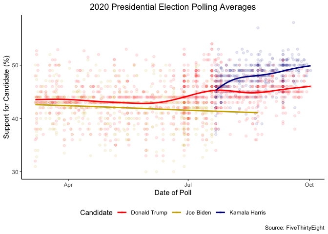
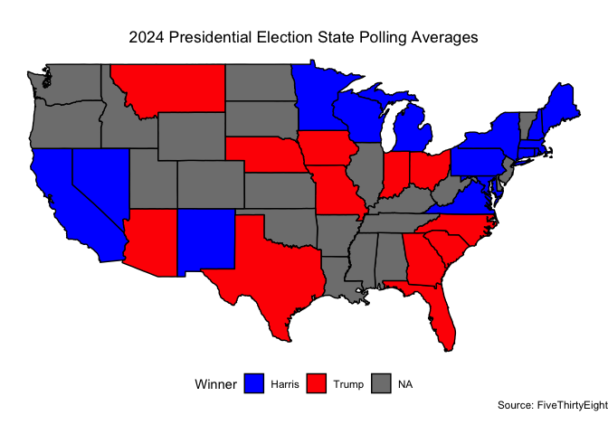
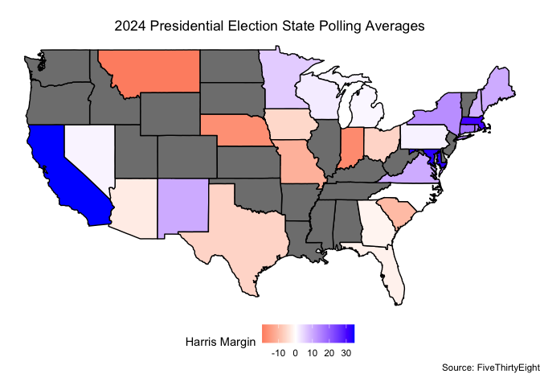

Final Exam
================
DATA 1010
Due October 21, 2023 at 11:59pm Eastern

This exam consists of 9 questions with a total of 100 points available.
You must submit a formal write up of your results, including any
visualizations you create. You must use an RMarkdown file to create the
write up. You will need to submit both the .rmd file and the finished,
knitted file. Please ensure that your graphs are nicely-formatted with
titles, meaningful axis labels, appropriate legend keys, etc.

Please remember to include an (empty) code chunk at the end of your
script with the following chunk options, which will print all of the
code in your RMarkdown file for the TAs to grade:

`{r ref.label=knitr::all_labels(), echo = TRUE, eval = FALSE}`

If you get stuck, you may ask clarifying questions on the Ed Discussion
board or to the TAs. Please do not post code related to the final exam
on Ed Discussion (general questions are still acceptable). The TAs will
be holding their regular office hours through October 21st.

For the final exam, we are going to use polling for the 2024
Presidential election to create a simple prediction model of the
outcome. We will be using two datasets:

- Data on 2024 election polls collected by
  [FiveThirtyEight](https://abcnews.go.com/538). This is posted on
  Canvas as `presidential_polls.csv`.

- Results of the 2020 Presidential election compiled by the [MIT
  Election Data + Science Lab](https://electionlab.mit.edu/). This is
  posted on Canvas as `2020-president.csv`.

------------------------------------------------------------------------

1.  Load the `presidential_polls.csv` data into R. Keep only the rows
    where:

- The candidate is Donald Trump and the start date is on or after March
  7, 2024.[^1]

- The candidate is Joe Biden and the start date is on or after March 7,
  2024.[^2]

- The candidate is Kamala Harris and the start date is on or after July
  22, 2024.

  We will call this data `polls` and use it for all of our analyses
  going forward. **(10 points)**

``` r
polls <- read_csv("data/presidential_polls.csv") |>
  mutate(start_date = mdy(start_date),
         end_date = mdy(end_date)) |>
  filter(
    (answer == "Trump" & start_date >= "2024-03-07") |
    (answer == "Biden" & start_date >= "2024-03-07") |
    (answer == "Harris" & start_date >= "2024-07-22"))
```

## Section 1: Biden Withdraws from the Race

2.  Create a scatterplot with trend lines that shows the change in each
    candidate’s support over the course of the race. Use only
    **national** (not state) polls. Use a red line for Trump’s support,
    a blue line for Harris’ support, and any other color for Biden’s
    support. What impact did Biden’s withdrawal from the race have on
    the polling averages? **(15 points)**

``` r
polls |>
  filter(is.na(state)) |>
  ggplot(aes(x = start_date, y = pct, color = candidate_name)) +
  geom_point(alpha = .1) +
  geom_smooth(se = FALSE) +
  scale_color_manual(values = c("red", "gold3", "darkblue")) +
  labs(x = "Date of Poll",
       y = "Support for Candidate (%)",
       title = "2020 Presidential Election Polling Averages",
       caption = "Source: FiveThirtyEight",
       color = "Candidate") +
  theme_classic() +
  theme(plot.title = element_text(hjust = .5),
        legend.position = "bottom")
```

<!-- -->

3.  Some people believe that polls with live interviews produce more
    accurate results than other types of polls. Create the same graph as
    above, but this time, include a comparison between polls that use at
    least some `"Live Phone"` interviews and those that do not. Do you
    believe that live phone polls suggest a different race trajectory
    than non-live phone polls? **(10 points)**

``` r
polls |>
  mutate(phone = ifelse(str_detect(methodology, "Live Phone"), "Live Interviews", "No Live Interviews")) |>
  filter(is.na(state) & !is.na(phone)) |>
  ggplot(aes(x = start_date, y = pct, color = candidate_name)) +
  geom_point(alpha = .1) +
  geom_smooth(se = FALSE) +
  scale_color_manual(values = c("red", "gold3", "darkblue")) +
  labs(x = "Date of Poll",
       y = "Support for Candidate (%)",
       title = "2020 Presidential Election Polling Averages",
       caption = "Source: FiveThirtyEight",
       color = "Candidate") +
  theme_classic() +
  theme(plot.title = element_text(hjust = .5),
        legend.position = "bottom") +
  facet_wrap(~ phone)
```

<!-- -->

### Section 2: Electoral College Map

4.  Keep only the **state** (not national) polls in the `polls` data
    that:

- the candidate is Kamala Harris or Donald Trump,
- have an end date on or after September 6, 2024, and
- are conducted by pollsters that 538 rates as 2.0 (out of 3) or
  greater. **(10 points)**

``` r
polls_state <-
  polls |>
  filter(!is.na(state)
         & answer %in% c("Harris", "Trump")
         & end_date >= "2024-09-06"
         & numeric_grade >= 2.0)
```

5.  Calculate the two-party share for each candidate in each poll using
    the formula,

    $CandidatePercent / (CandidatePercent+OpponentPercent) * 100$

    *(Hint: Although `question_id` is the unique identifier for a poll,
    you will need to use `state` as an ID column as well.)*

    **(10 points)**

``` r
polls_state <-
  polls_state |>
  pivot_wider(id_cols = c(question_id, state), names_from = answer, values_from = pct) |>
  mutate(Harris_two_party = Harris/(Harris+Trump)*100,
         Trump_two_party = Trump/(Harris+Trump)*100)
```

6.  Create a map showing the predicted winner in each state according to
    the polling average. There may not be polls available for every
    state. **(15 points)**

``` r
states <- map_data("state")
polls_state |>
  group_by(state) |>
  summarize(Harris_avg = mean(Harris_two_party),
            Trump_avg = mean(Trump_two_party)) |>
  mutate(winner = ifelse(Harris_avg > Trump_avg, "Harris", "Trump"),
         state = str_to_lower(state)) |>
  right_join(states, by = join_by(state == region)) |>
  ggplot() +
  geom_polygon(aes(x = long, y = lat, group = group, fill = winner), color = "black") +
  scale_fill_manual(values = c("blue", "red")) +
  labs(x = "",
       y = "",
       title = "2024 Presidential Election State Polling Averages",
       caption = "Source: FiveThirtyEight",
       fill = "Winner") +
  coord_quickmap() +
  theme_void() +
  theme(plot.title = element_text(hjust = .5),
        legend.position = "bottom")
```

<!-- -->

7.  Create the same map, but use a color gradient such that larger
    Harris two-party shares are darker shades of blue, larger Trump
    two-party shares are darker shades of red, and states where the
    polls are basically tied are white. **(10 points)**

``` r
states <- map_data("state")
polls_state |>
  group_by(state) |>
  summarize(Harris_avg = mean(Harris_two_party, ),
            Trump_avg = mean(Trump_two_party)) |>
  mutate(diff = Harris_avg - Trump_avg,
         state = str_to_lower(state)) |>
  right_join(states, by = join_by(state == region)) |>
  ggplot() +
  geom_polygon(aes(x = long, y = lat, group = group, fill = diff), color = "black") +
  scale_fill_gradient2(low = "red", mid = "white", high = "blue") +
  labs(x = "",
       y = "",
       title = "2024 Presidential Election State Polling Averages",
       caption = "Source: FiveThirtyEight",
       fill = "Harris Margin") +
  coord_quickmap() +
  theme_void() +
  theme(plot.title = element_text(hjust = .5),
        legend.position = "bottom")
```

<!-- -->

### Section 3: Change from 2020

8.  Join the 2020 election results data to the state polling data.
    Calculate the change in the Democratic candidate’s two-party vote
    share between the 2020 election and the 2024 polling averages for
    each state. What are the five states with the largest predicted
    swing to Harris? What are the five states with the largest predicted
    swing to Trump? **(15 points)**

``` r
results <- read_csv("data/2020-president.csv") |>
  pivot_wider(names_from = candidate_name, values_from = two_party_vote)

delta <- polls_state |>
  group_by(state) |>
  summarize(Harris_avg = mean(Harris_two_party, ),
            Trump_avg = mean(Trump_two_party)) |>
  mutate(state = str_to_upper(state)) |>
  inner_join(results, by = join_by(state)) |>
  mutate(DemChange = Harris_avg - Biden*100)

delta |>
  select(state, DemChange) |>
  arrange(DemChange) |>
  head(5) |>
  knitr::kable()
```

| state         | DemChange |
|:--------------|----------:|
| NEW YORK      | -4.923388 |
| RHODE ISLAND  | -2.608836 |
| MASSACHUSETTS | -1.725626 |
| ARIZONA       | -1.621080 |
| MONTANA       | -1.488875 |

``` r
delta |>
  select(state, DemChange) |>
  arrange(desc(DemChange)) |>
  head(5) |>
  knitr::kable()
```

| state      | DemChange |
|:-----------|----------:|
| CALIFORNIA |  2.506819 |
| MISSOURI   |  2.066156 |
| NEBRASKA   |  1.450719 |
| IOWA       |  1.325541 |
| OHIO       |  0.897003 |

9.  Based on everything we’ve learned so far, comment on the results.
    What do the polling averages tell you about this year’s Presidential
    election? Your answer should be a paragraph or less. **(5 points)**

[^1]: This is the date when Donald Trump became the presumptive
    Republican nominee.

[^2]: This is the last day that Joe Biden was the presumptive Democratic
    nominee.
