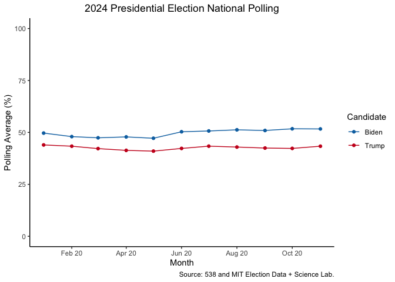
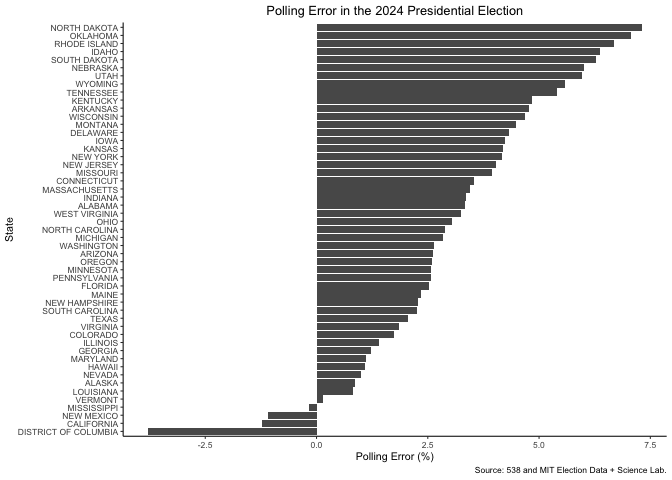

# Make-up Assignment
SMPA 2152 (Prof. Bell)

For this week’s homework, we are going to explore how well the polls did
in predicting the results of the 2020 Presidential Election. We will be
using two datasets:

- Data on 2020 election polls collected by FiveThirtyEight (RIP). This
  data is available on Blackboard as `presidential_polls_2020.csv`.

- Results of the 2020 Presidential election compiled by the [MIT
  Election Data + Science Lab](https://electionlab.mit.edu/). This data
  is available on Blackboard as `2020-president.csv`.

------------------------------------------------------------------------

``` r
library(tidyverse)
```

1.  Load the `presidential_polls_2020.csv` data and turn it into tidy
    data. In addition, limit the data to polls that:

    1.  are national polls (i.e., are not state polls).
    2.  are conducted by pollsters with a rating from 538 of 2.0 or
        higher.

``` r
polls <- read_csv("presidential_polls_2020.csv")

polls <- polls |>
  pivot_longer(cols = c("Biden", "Trump"), names_to = "candidate", values_to = "pct") |>
  filter(numeric_grade >= 2 & is.na(state))
```

2.  Make a nicely-formatted graph showing the average support for Joe
    Biden and Donald Trump in each month over the course of the race.

    *Hint: You can use the make_date() function to create a date column
    for your x-axis:*

``` r
polls |>
  mutate(date = make_date(year, month))
```

``` r
polls |>
  group_by(candidate, month, year) |>
  summarize(pct = mean(pct, na.rm = T)) |>
  mutate(date = make_date(year, month)) |>
  ggplot(aes(x = date, y = pct, color = candidate)) +
  geom_point() +
  geom_line() +
  scale_x_date(date_breaks = "2 months", date_labels = "%b %y") +
  scale_y_continuous(limits = c(0,100)) +
  scale_color_manual(values = c("#0671B0", "#CA0120")) +
  labs(x = "Month",
       y = "Polling Average (%)",
       color = "Candidate",
       title = "2024 Presidential Election National Polling",
       caption = "Source: 538 and MIT Election Data + Science Lab.") +
  theme_classic() +
  theme(plot.title = element_text(hjust = .5))
```



3.  Reload the `presidential_polls_2020.csv` and keep only the polls
    that:

    1.  are state polls.
    2.  are conducted in October or November 2020.
    3.  are conducted by pollsters with a rating from 538 of 2.0 or
        higher.

    In addition, calculate the average two-party vote share for Biden
    *in each state*. The two-party vote share is:

    $BidenPct/(BidenPct + TrumpPct)$

    You should calculate the two-party vote share before calculating the
    average in each state.

``` r
polls <- read_csv("presidential_polls_2020.csv")

polls <- polls |>
  filter(month >= 10 & numeric_grade >= 2 & !is.na(state)) |>
  mutate(BidenShare = Biden/(Biden+Trump)*100) |>
  group_by(state) |>
  summarize(avg_biden = mean(BidenShare))
```

4.  Load the `2020-president.csv` data to the polling data. Generate a
    polling error in each state by comparing the average two-party vote
    share for Biden in each state according to the polling vs. the
    actual two-party vote share for Biden in the election results.

    Make a nicely-formatted graph showing the polling error in each
    state arranged from largest to smallest polling error. Comment on
    the graph. What does this graph tell you about state polling in the
    2020 election?

``` r
elec <- read_csv("2020-president.csv")
elec |>
  filter(candidate_name == "Biden") |>
  mutate(two_party_vote = two_party_vote*100) |>
  inner_join(polls, by = join_by(state)) |>
  mutate(difference = avg_biden - two_party_vote) |>
  ggplot() +
  geom_col(aes(y = reorder(state, difference), x = difference)) +
  labs(x = "Polling Error (%)",
       y = "State",
       title = "Polling Error in the 2024 Presidential Election",
       caption = "Source: 538 and MIT Election Data + Science Lab.") +
  theme_classic(base_size = 8) +
  theme(plot.title = element_text(hjust = .5))
```



> Some of the largest polling errors were in states that are not
> competitive, meaning that there probably was not much polling in those
> states. However, most states have a polling error which overestimates
> Biden’s vote share, suggesting a general pattern in 2020 election
> polling to overestimate Biden.
