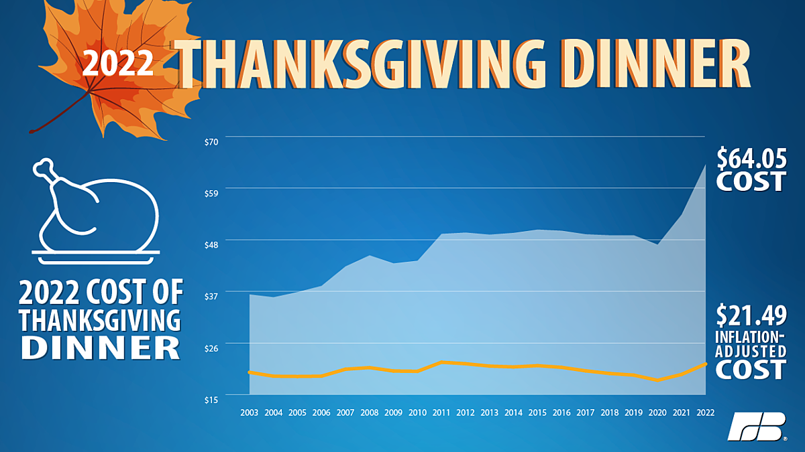

## Midterm Exam Answer Key
### SMPA 2152 (Fall 24)

***

### Short Answer Questions

1. In 2014, researchers at Facebook published the results of a study in which 689,003 randomly selected users were shown either more positive posts, or more negative posts, than usual. The researchers measured how the users own posts changed in response to reading more positive or negative posts. The researchers wrote, "We felt that it was important to investigate the common worry that seeing friends post positive content leads to people feeling negative or left out." The subjects were not informed of that they were selected for the study, but Facebook's terms of service permit these kinds of studies, and Facebook frequently experiments with changes to its algorithms to understand the effect on user engagement. What are some of the ethical considerations at play in this study? In what ways did Facebook act ethically or unethically?

    > Possible answers include:
    
    > * Informed consent: the users were not given the opportunity to decide whether to participate in the study, which violates the principle of respect for persons. The terms of service are not clear and unambiguous information about what participation in the study involves and the potential harms or benefits of participation.
    > * Beneficence: The study could potentially harm participants by causing emotional distress. This may not be the least harmful way to obtain information about user responses to positive and negative posts.
    > * Understanding how users respond to different types of posts could lead to significant improvements in society, which justifies potentially harmful research as long as the harm is minimized.
    > * Deception is required in this circumstance because knowledge of study participation could influence the results and result in less societal benefit (however, participants should be debriefed after the fact.)

2. One of the most cited studies in political science is about the causes of civil war. In this study, the authors argue that civil wars are not associated with ethnic or religious divisions but rather how vulnerable the country is to rebellion. The authors measure ethnic diversity as the number of distinct languages spoken by at least 1% of the country's population, and measure how vulnerable the country is to rebellion as the percent of the country that is mountainous (since rebels are better able to hide and surprise their opponents in rough terrain). Evaluate the operationalization of either ethnic diversity **or** vulnerability to rebellion. In what ways is this operationalization strong? In what ways is this operationalization weak?

    > Ethnic diversity measured as the number of languages spoken:
    
    > * Unambiguous: What does it mean for a language to be spoken? At home? At work? In school? As a second langauge? In addition, is language a good proxy for ethnicity?
    > * Concise: The definition is fairly concise.
    > * Familiar: It is not clear to most people what it means for 1% of a population to speak a particular language, but most people know that there are minority langauges spoken in many places.
    > * Available: Perhaps. This would require some kind of survey or government study, which may not exist, or may be biased or incomplete.
    
    > Vulnerability to rebellion as percent mountainous:
    
    > * Unambiguous: What is the distinction between hilly and mountainous? How mountainous must terrain be for it to be useful for rebels?
    > * Concise: The definition is concise.
    > * Familiar: Most people are familiar with mountainous terrain, but are unlikely to understand it's relationship to guerrilla warfare or other strategies of rebellion.
    > * Available: Likely available.

3. The political science book "The Big Sort" argues that people are moving to communities and parts of the country where others share their political beliefs, and this is contributing to political polarization. There is no doubt that the country's politics are divided by geography, but why might we be skeptical of the claim that people are moving to places where others share their political beliefs? Provide at least two reasons.

    > * Confounding: political beliefs are influenced by many of the same things that influence where someone lives. Confounders include the person's age (younger people are more likely to be liberal and live in cities), occupation or education (skilled/educated workers are more likely to be liberal and live in cities), religion (e.g., evangelical Christians are more likely to be conservative and live in rural areas), and more.
    > * Reverse causation: political beliefs are also influenced by where someone lives. For example, voters who live in racially diverse areas may be more (or less) favorable towards race-based policies like affirmative action, or voters who live in areas with a lot of immigration may be more (or less) favorable towards restrictive immigration policies.

4. Evaluate the following graph from the American Farm Bureau. What elements of the graph would you change, and how would you change them?

    {width=65%}
    
    > * The y-axis starts at \$15 rather than \$0, which distorts differences and makes the cost look like it has risen more significantly than it really has.
    > * The y-axis has breaks every \$11 rather than every \$10.
    > * The inflation-adjusted cost is caused to be hidden by it's lower position on the graph, and the light blue unadjusted cost creates a closure on the graph that focuses our perception.
    > * The jagged lines are harder to follow than smooth lines (continuity).
    > * Contrasting colors would be more perceptible than a light blue area vs. a dark blue background.
    > * No axis labels, source, or legend.
    
### Essay

1. Both the 2016 and 2020 presidential election polls underestimated support for Donald Trump. Should we trust the polls in this year's election? In what ways have the issues in polling from those election been fixed (or not)? Provide reasons and/or evidence to support your position.

    > *Grading rubric is available on Blackboard.*

    > Arguments in favor:
    > * Polling error is normal. Although the 2020 election featured an unusually large polling error, it was confounded by a novel pandemic with record-high turnout.
    > * Most pollsters are weighting by education, which was a key issue in the 2016 election polling error. Respondents without a college degree (espeically whites without a college degree) were less likely to respond to polls and also more likely to support Donald Trump. This is **missing at random** data that can be corrected using weighting.
    > * Although there is no statistical method to correct for **missing not at random** data, in which Trump supporters are less likely to speak to a pollster, pollsters are trying novel techniques like weighting on 2020 recalled vote and counting partial responses from Trump supporters.
    > * There is no evidence to support the "shy Trump voters" theory, since respondents are just as likely to support Trump in a phone poll as an online poll.
    > * There is not yet much evidence of herding among 2024 pollsters.
    
    > Arguments against:
    > * Although the 2020 polls weighted by education, they were still wrong. This may be due to **missing at random** data due to another confounder, such as social trust, that is much harder to measure.
    > * There is no statistical method to correct for **missing not at random** data, in which Trump supporters are less likely to speak to a pollster.
    > * Response rates to surveys are declining, and pollsters are getting fewer Republican respondents in their surveys. This means that they have to weight Republicans to a greater degree, which makes them more susceptible to outliers (as in the case of the LA Times 2016 panel survey).
    > * There is something unique about elections in which Donald Trump is a candidate that we still do not fully understand. There is evidence for this in the fact that issue polling appears to be unaffected by the biases influencing horse race polling in which Trump is a candidate.
    > * There is no guarantee that the same polling error we observed in 2016 and 2020 (and which pollsters have corrected for) will also be observed in 2024.
    > * We have already seen some unusual patterns between online polls and phone polls, especially with respect to young voters.