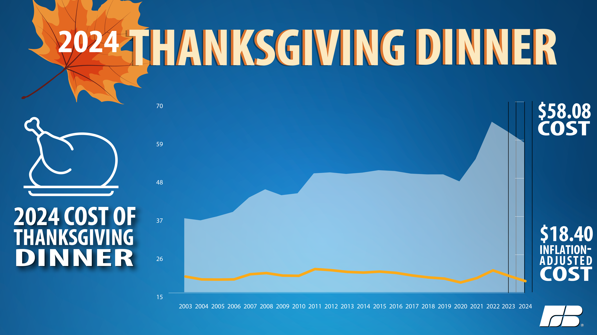

## Midterm Exam Answer Key

### SMPA 2152 (Fall 25)

------------------------------------------------------------------------

### Short Answer Questions

1.  In 2014, researchers at Facebook published the results of a study in which 689,003 randomly selected users were shown either more positive posts, or more negative posts, than usual. The researchers measured how the users own posts changed in response to reading more positive or negative posts. The researchers wrote, "We felt that it was important to investigate the common worry that seeing friends post positive content leads to people feeling negative or left out." The subjects were not informed of that they were selected for the study, but Facebook's terms of service permit these kinds of studies, and Facebook frequently experiments with changes to its algorithms to understand the effect on user engagement. What are some of the ethical considerations at play in this study? In what ways did Facebook act ethically or unethically?

    > Possible answers include:

    > -   Informed consent: the users were not given the opportunity to decide whether to participate in the study, which violates the principle of respect for persons. The terms of service are not clear and unambiguous information about what participation in the study involves and the potential harms or benefits of participation.
    > -   Beneficence: The study could potentially harm participants by causing emotional distress. This may not be the least harmful way to obtain information about user responses to positive and negative posts.
    > -   Understanding how users respond to different types of posts could lead to significant improvements in society, which justifies potentially harmful research as long as the harm is minimized.
    > -   Deception is required in this circumstance because knowledge of study participation could influence the results and result in less societal benefit (however, participants should be debriefed after the fact.)

2.  One of the most cited studies in political science is about the causes of civil war. In this study, the authors argue that civil wars are not associated with ethnic or religious divisions but rather how vulnerable the country is to rebellion. The authors measure ethnic diversity as the number of distinct languages spoken by at least 1% of the country's population, and measure how vulnerable the country is to rebellion as the percent of the country that is mountainous (since rebels are better able to hide and surprise their opponents in rough terrain). Evaluate the operationalization of either ethnic diversity **or** vulnerability to rebellion. In what ways is this operationalization strong? In what ways is this operationalization weak?

    > Ethnic diversity measured as the number of languages spoken:

    > -   Unambiguous: What does it mean for a language to be spoken? At home? At work? In school? As a second language? In addition, is language a good proxy for ethnicity?
    > -   Concise: The definition is fairly concise.
    > -   Familiar: It is not clear to most people what it means for 1% of a population to speak a particular language, but most people know that there are minority languages spoken in many places.
    > -   Available: Perhaps. This would require some kind of survey or government study, which may not exist, or may be biased or incomplete.

    > Vulnerability to rebellion as percent mountainous:

    > -   Unambiguous: What is the distinction between hilly and mountainous? How mountainous must terrain be for it to be useful for rebels?
    > -   Concise: The definition is concise.
    > -   Familiar: Most people are familiar with mountainous terrain, but are unlikely to understand it's relationship to guerrilla warfare or other strategies of rebellion.
    > -   Available: Likely available.

3.  The political science book "The Big Sort" argues that people are moving to communities and parts of the country where others share their political beliefs, and this is contributing to political polarization. There is no doubt that the country's politics are divided by geography, but why might we be skeptical of the claim that people are moving to places where others share their political beliefs? Provide at least two reasons.

    > -   Confounding: political beliefs are influenced by many of the same things that influence where someone lives. Confounders include the person's age (younger people are more likely to be liberal and live in cities), occupation or education (skilled/educated workers are more likely to be liberal and live in cities), religion (e.g., evangelical Christians are more likely to be conservative and live in rural areas), and more.
    > -   Reverse causation: political beliefs are also influenced by where someone lives. For example, voters who live in racially diverse areas may be more (or less) favorable towards race-based policies like affirmative action, or voters who live in areas with a lot of immigration may be more (or less) favorable towards restrictive immigration policies.

4.  Evaluate the following graph from the American Farm Bureau. What elements of the graph would you change, and how would you change them?

    {width="65%"}

    > -   The y-axis starts at \$15 rather than \$0, which distorts differences and makes the cost look like it has risen more significantly than it really has.
    > -   The y-axis has breaks every \$11 rather than every \$10.
    > -   The inflation-adjusted cost is caused to be hidden by it's lower position on the graph, and the light blue unadjusted cost creates a closure on the graph that focuses our perception.
    > -   The jagged lines are harder to follow than smooth lines (continuity).
    > -   Contrasting colors would be more perceptible than a light blue area vs. a dark blue background.
    > -   No axis labels, source, or legend.
    > -   There is a fair bit of chartjunk on this graph.

### Essay

Imagine that you have been asked to do a study for the Hatchet about how GW students engage with Washington, D.C. How would you design this study? What would be the limitations of your study that you need to communicate to readers? In your response, you should consider:

-   Operationalization
-   The data generating process (sampling)
-   Correlation vs. causation
-   How to collect your data ethically

and any other relevant topics.

> *Grading rubric is available on Blackboard.*

> **Operationalization**: The concept that we are interested in measuring is "engagement with DC". The operationalization that we select should be unambiguous, concise, familiar, and available. For example, if we selected "number of times that a student takes Metro or Metrobus" as our operationalization, this would be:
>
> -   Unambiguous because it is clear when someone boards Metro or Metrobus and when they do not. However, we may need to add a timeframe to this operationalization, such as "number of times in the last week."
> -   Concise because it is straightforward.
> -   Familiar because it does not require much explanation on the part of the researcher.
> -   Available because one can ask students how many times they take Metro or Metrobus and the student will know the answer. Alternatively, we might be able to use data from Metro on SmartTrip cards to answer this question, which would be a more accurate.
>
> The **data generating process** is the process and procedures that we use to collect our data. The most prominent issue we face is selection bias. If we survey students on their Metro and Metrobus usage, it would be inappropriate to survey only students who are boarding Metro, because those students are more likely to use public transportation than the average student. If we choose to observe students boarding Metro ourselves (i.e., sitting outside of a bus stop or Metro station and counting GW students), we may still have selection bias if we choose a stop where students are more or less likely to board if they are taking Metro and Metrobus.
>
> We must be mindful of **correlation vs. causation** in evaluating *why* GW students are riding Metro or Metrobus. There may be experimental approaches we could try. For example, if we hypothesize that students are more likely to use public transportation when information about routes is more easily available, we could randomly assigning some students to receive a flyer about bus routes and times, and compare how much the students in the treatment group use Metrobus against students in the control group who did not get a flyer. However, we are more likely going to use observational data in this study, so we need to be cognizant of potential confounders and reverse causation. I.e., if we find that students with internships are more likely to use Metro since they need to get to their workplaces, we might think about confounders: students who are more outgoing are more likely to use public transportation AND are more likely to get internships.
>
> At a minimum, the response should include a discussion of informed consent and risks vs. benefits from participation. All subjects should be provided information about what their participation in the study entails and affirmatively agree to participate. In this example, it is very unlikely that there are risks to subjects from participating in this study, but there may be benefits to student life by conducting this study, since it will inform school leaders and DC policymakers about how to make the city more available and accessible to students. 
