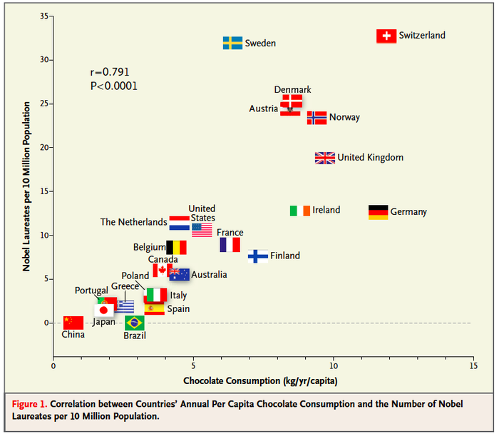

In each of the examples below, identify a reason why correlation does not imply causation.

1. The amount of chocolate that a country consumes is correlated with the number of Nobel Prize winners. Chocolate contains flavanols, which stimulate blood flow to the brain.

 

2. Kids who sleep with a night light are more likely to develop poor eye sight.

3. Students who eat breakfast perform better on exams than students who do not eat breakfast.

4. The amount of money that a political candidate raises for their campaign increases the likelihood that they will win the election.

5. Living near electric power lines increases the likelihood of developing leukemia.