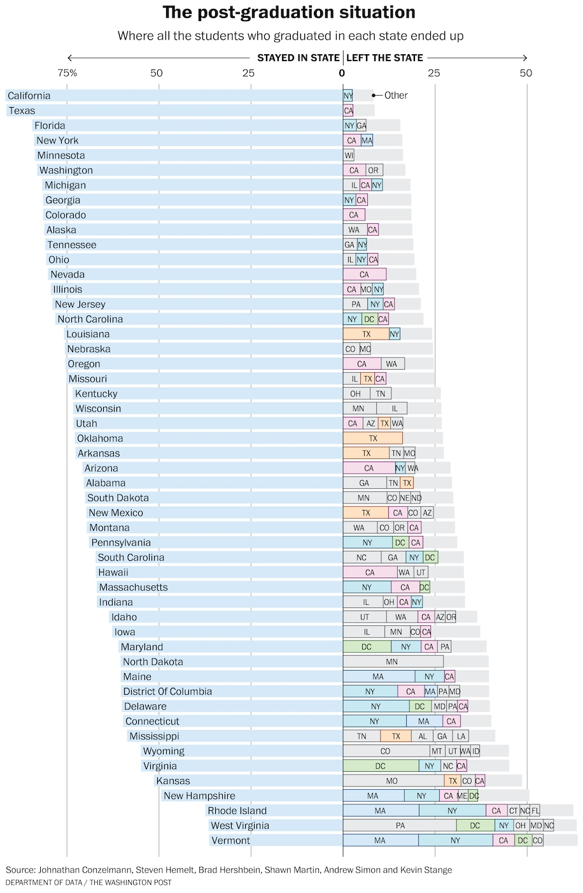
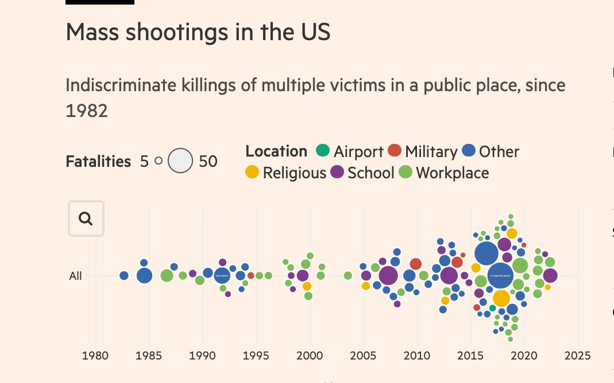

## Evaluating Graphs ##

1. Make a note of the first few things you see
2. Make a note of the first idea that forms in your mind and then search for more
3. Make notes on likes, dislikes, and wish-I-saws
4. Find three things you'd change and briefly say why

