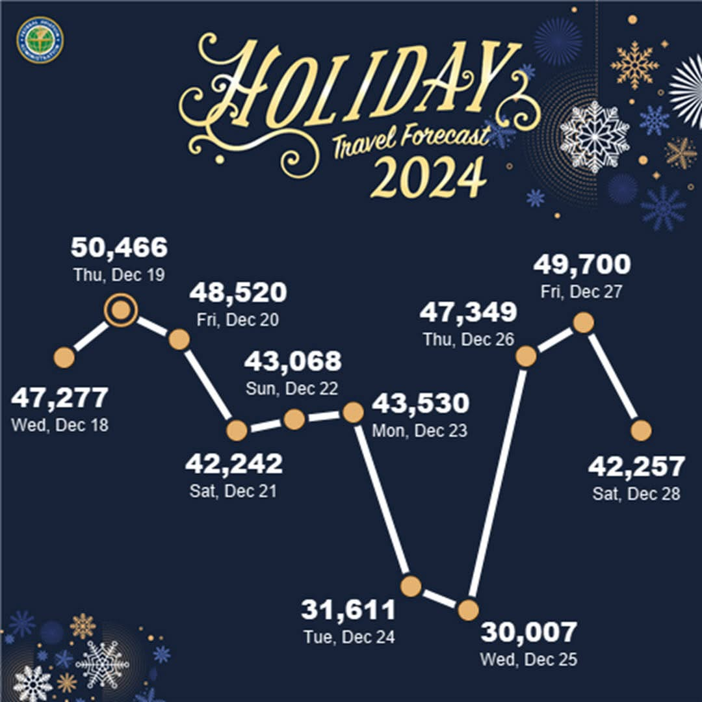
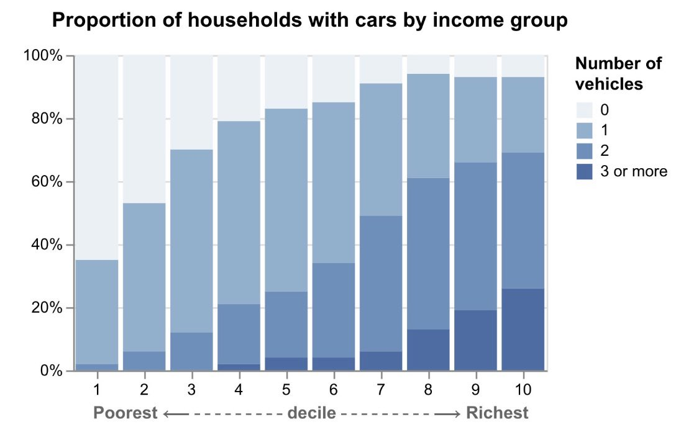

1. Make a note of the first few things you see
2. Make a note of the first idea that forms in your mind and then search for more
3. Make notes on likes, dislikes, and wish-I-saws
4. Find three things you'd change and briefly say why

<table>
<tr>
<td>
1. ____________________________________________  
____________________________________________  
____________________________________________  
2. ____________________________________________  
____________________________________________  
____________________________________________  
3. ____________________________________________  
____________________________________________  
____________________________________________  
4. ____________________________________________  
____________________________________________  
____________________________________________  
</td>
<td>
&emsp;&emsp;
</td>
</tr>
<tr><td>  </td></tr>
<tr>
<td>
1. ____________________________________________  
____________________________________________  
____________________________________________  
2. ____________________________________________  
____________________________________________  
____________________________________________  
3. ____________________________________________  
____________________________________________  
____________________________________________  
4. ____________________________________________  
____________________________________________  
____________________________________________  
</td>
<td>
&nbsp;&nbsp;
</td>
</tr>
</table>

